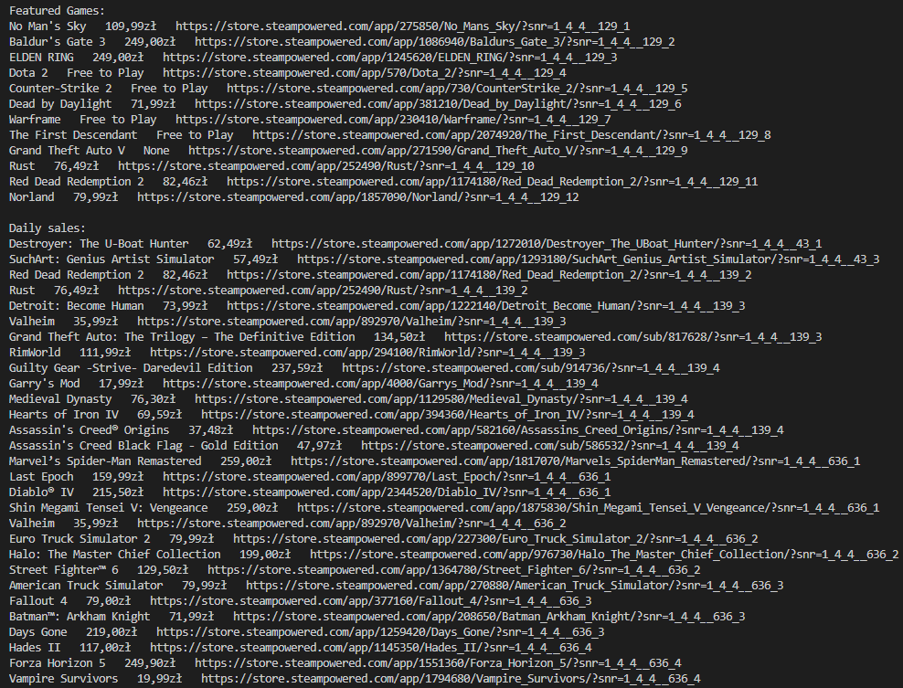

# Web Scraping
Objective: Create an app that is capable of fetching data from the internet for to user to use.  
Result: 
Application displays **featured games** and **games on daily sale** from the website `https://store.steampowered.com/`  
  

Uses **beautifulsoup4** https://pypi.org/project/beautifulsoup4/  
Uses **Selenium** https://www.selenium.dev/documentation/webdriver/getting_started/first_script/  
Guide for bs4 https://www.crummy.com/software/BeautifulSoup/bs4/doc/  

Thoughts:
Tool for fetching data must support js to web-scrap dynamicly. lib requests doesn't suppoer js

# Requirements
- Python 3.11
- [Miniconda](https://docs.anaconda.com/free/miniconda/index.html)
- `pip install -r requirements.txt`